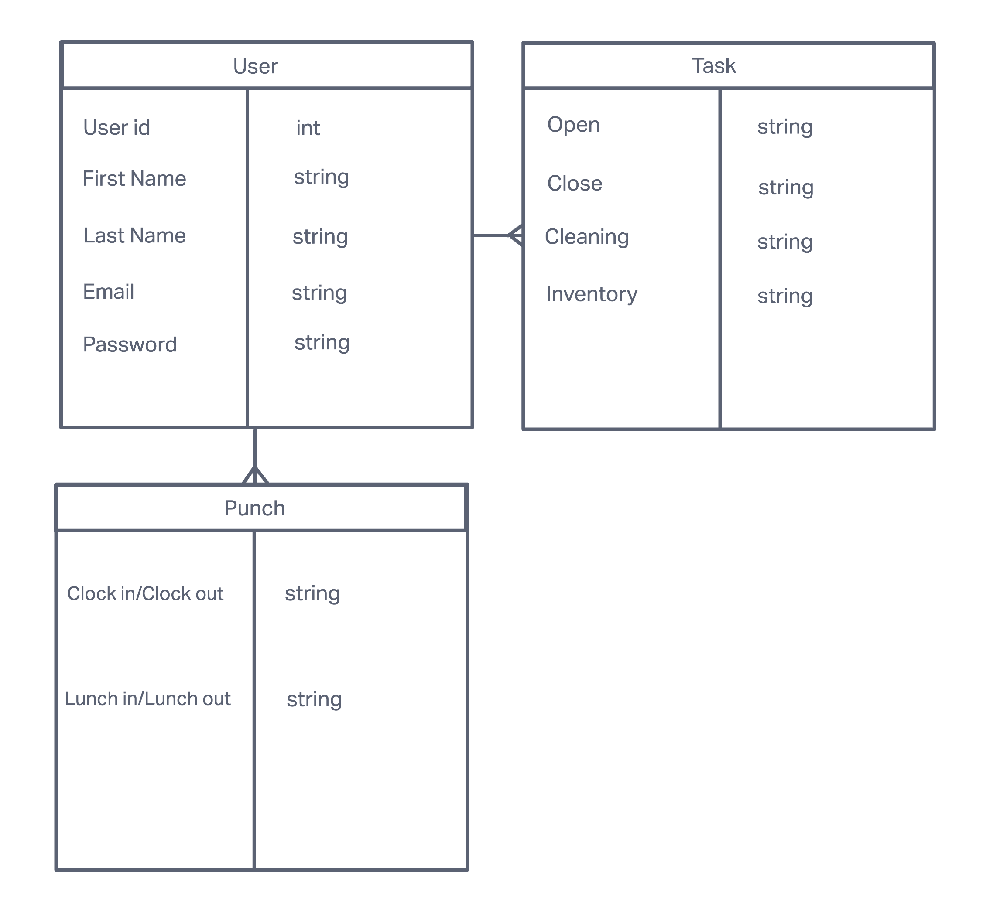
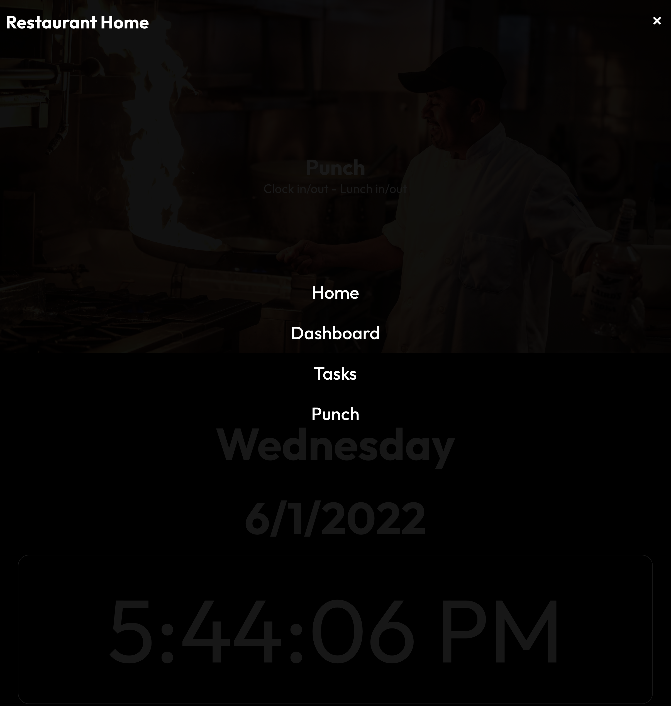
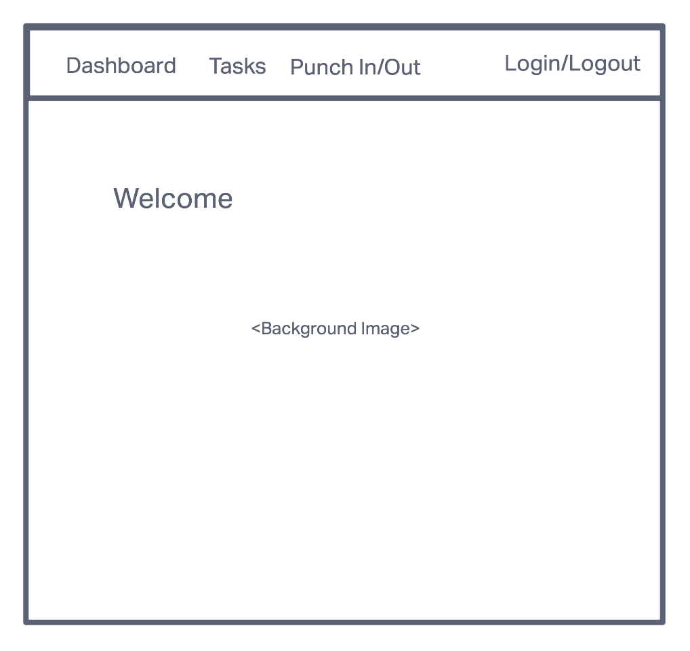
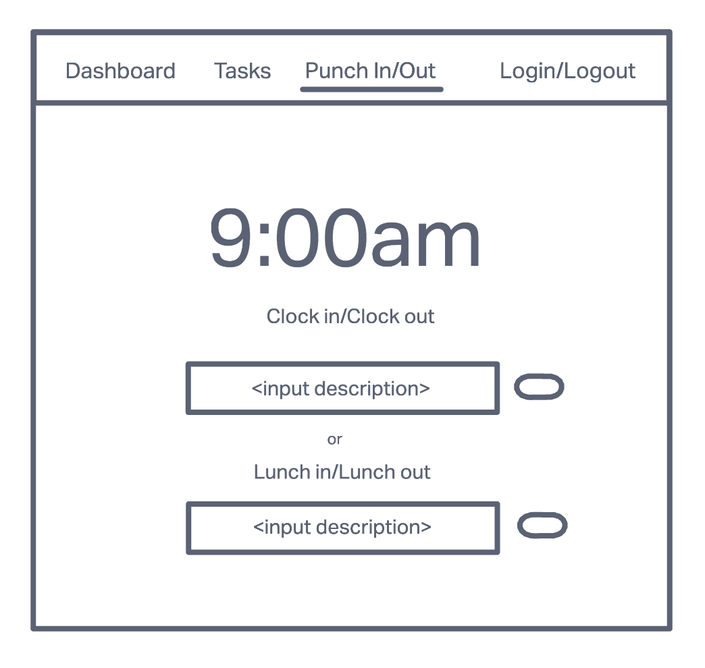
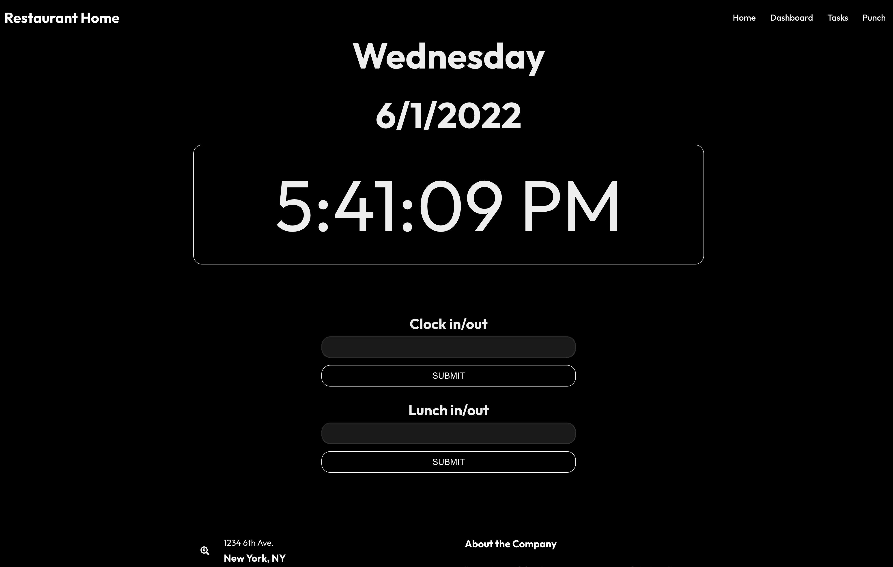
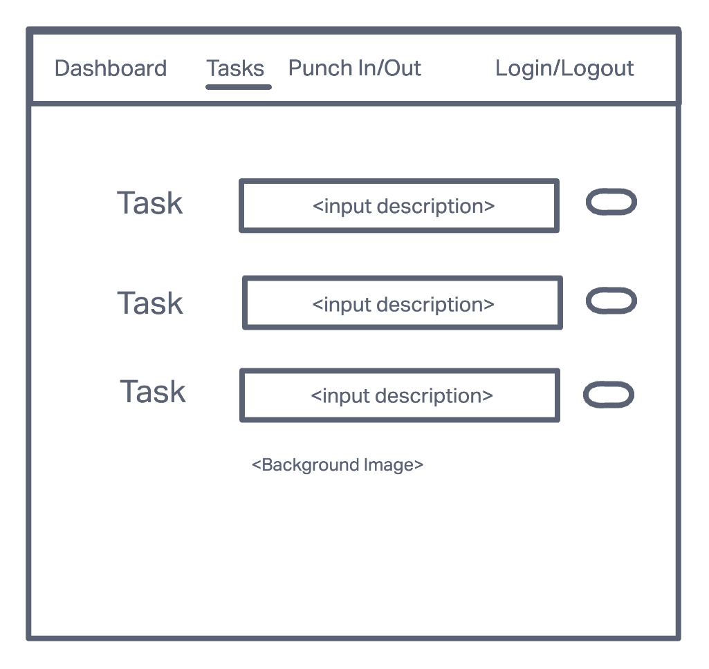
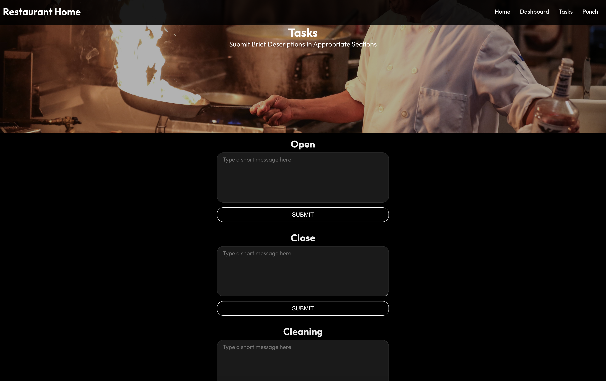
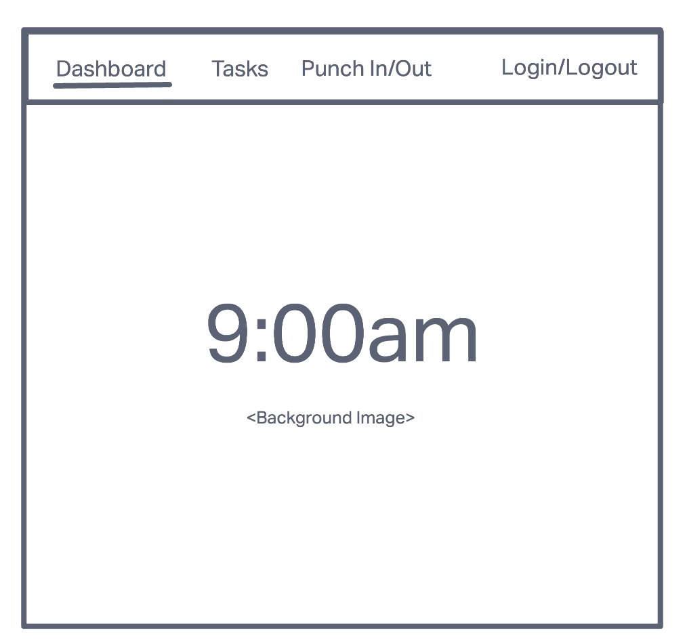

# Food Truck Home 🌯 🍔 🍕

#### Web App that will allow employees of restaurants or small businesses to clock in and out and document daily procedures and tasks.

###  - By Allen Timothe

## Live Photos

## Technologies Used ⚙️ 🛠

* React JS
* Node JS
* PostgreSQL
* Express
* Materials UI
* Deployed using Heroku

## Live Link ‼️ 🚀 🔥 🎬

## Wire Frames

## Future Updates 🔮

* Add Fully Customizable POS System.

## Contact 📥 📨
* allen.timothe@gmail.com
